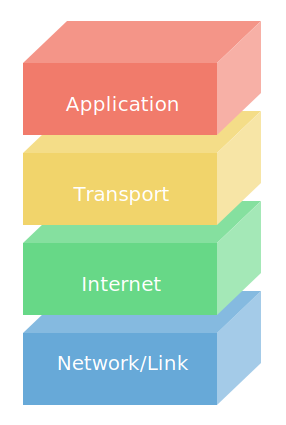

#### 1. In a binary search tree, which of the following depth-first tree traversal methods would result in retrieving the nodes in _ascending sorted order_?

#### 2. Of the following features, which ones can a graph have but a tree cannot?

#### 3. The first four bits of an IPv6 packet's header is the version number that translates to "6". Which of the following binary representations represents the number 6?

#### 4. Assuming that a _binary_ tree has four nodes, what is the _maximum_ number of leaf nodes the tree could have?

#### 5. Choose the following conditions that MUST be met for a binary tree to be a binary search tree. 

#### 6. What are the two major classifications of tree traversal that you learned about in this material?

#### 7. TCP connections provide two important needs for computer-to-computer communications. Choose them from the following list.

#### 8. Assuming that a binary (or any) tree is not empty, what is the least number of parent nodes that a binary tree can have?

#### 9. In the Domain Name Service (DNS), which one of the following record types maps a domain name such as "appacademy.io" directly to an IP address? 

#### 10. What type of search would you use to determine the shortest distance between two people in a social network?

#### 11. Assuming that a _binary_ tree has four nodes, what is the _minimum_ number of leaf nodes the tree could have? 

#### 12. What is the only node in a binary (or any) tree that does not have a parent node?

#### 13. The first four bits of an IPv4 packet's header is the version number that translates to "4". Which of the following binary representations represents the number 4?

#### 14. How many nodes does the tree in the image have? 

#### 15. How many leaf nodes are in the image of the tree?

#### 16. Which of these approaches are commonly used to store graph data?

#### 17. In the Domain Name Services (DNS), which one of the following record types indicates the server that can handle email traffic?

#### 18. What protocol does the above image model?
