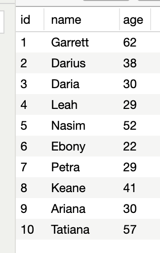

#### 1. Which of the following statements can begin a valid PostgreSQL statement?
- [x] `CREATE USER`
- [ ] `INSERT USER`
- [x] `DROP DATABASE`
- [ ] `DELETE USER`
- [ ] `DELETE DATABASE`
- [x] `DROP USER`
- [ ] `INSERT DAMAGE`
- [x] `CREATE DATABASE`

---

#### 2. Which of the following statements would create a foreign key constraint between a column named "house_id" in the current table and the column "id" in the table "houses"?
- [ ] FOREIGN KEY house_id REFERENCES houses (id)
- [ ] FOREIGN KEY CURRENT_TABLE(house_id) REFERENCES houses (id)
- [x] FOREIGN KEY (house_id) REFERENCES houses (id)
- [ ] FOREIGN KEY (house_id) REFERENCES houses.id

---

#### 3. What is the purpose of a primary key?
- [x] It is a value that uniquely identifies a row in a table
- [ ] It is a value computed from the values of other columns in a table
- [ ] It is a value used to reference a row in another table
- [ ] It is the way that an RDBMS identifies a table in a database

---

```
SELECT id, name, age
FROM people
WHERE id > 5
AND name LIKE '%e%';
```



#### 4. Given the above data and SQL statement, how many records will the SQL statement return?
- [ ] 5
- [x] 2
- [ ] 4
- [ ] 3
- [ ] 1

---

#### 5. Assuming no related data exists, what would the SQL statement `DELETE FROM users;` do?
- [ ] nothing, because it is not valid SQL
- [ ] delete the most recently-added record from the table "users"
- [x] delete all of the data from the table "users"
- [ ] delete all logins from the database

---

#### 6. What is a Relational Database Management System (RDBMS)?
- [x] a software package that manages relational databases and the users that can access it
- [ ] the superuser that has all privileges to manage data in tables
- [ ] a container of data and the relations between the data
- [ ] tables, primary keys, and foreign keys
