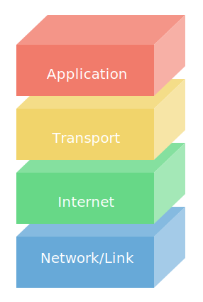

#### 1. What type of search would you use to determine the shortest distance between two people in a social network?
- [ ] a cyclic search
- [ ] a relationship search
- [ ] a depth-first search
- [x] a breadth-first search

---

#### 2. Which of these approaches are commonly used to store graph data?
- [ ] adjacency pool
- [x] object orientation
- [x] adjacency matrix
- [x] adjacency list

---

#### 3. How many nodes does the tree in the image have?
- [ ] 8
- [ ] 5
- [ ] 7
- [ ] 4
- [x] 6

---

#### 4. In the Domain Name Services (DNS), which one of the following record types indicates the server that can handle email traffic?
- [ ] an SOA record
- [ ] an A record
- [ ] an NS record
- [x] an MX record

---

#### 5. How many leaf nodes are in the image of the tree?
- [ ] 2
- [x] 3
- [ ] 4
- [ ] 1
- [ ] 5

---

#### 6. Of the following features, which ones can a graph have but a tree cannot?
- [ ] a graph can have only one node but a tree must have more than one node
- [x] a graph can have no root node but a tree must have a root
- [ ] a graph can have leaf nodes but a tree cannot have leaf nodes
- [x] a graph can have cycles but a tree cannot

---

#### 7. In a binary search tree, which of the following depth-first tree traversal methods would result in retrieving the nodes in _ascending sorted order_?
- [ ] post-order 
- [x] in-order 
- [ ] min-max-order
- [ ] pre-order

---

#### 8. The first four bits of an IPv4 packet's header is the version number that translates to "4". Which of the following binary representations represents the number 4?
- [ ] 1000
- [ ] 0010
- [ ] 0001
- [x] 0100

---

#### 9. In the Domain Name Service (DNS), which one of the following record types maps a domain name such as "appacademy.io" directly to an IP address?
- [ ] an SOA record
- [ ] a CNAME record
- [x] an A record
- [ ] an NS record

---

#### 10. Assuming that a _binary_ tree has four nodes, what is the _maximum_ number of leaf nodes the tree could have? 
- [ ] 4
- [ ] 3
- [x] 2
- [ ] 1

---

#### 11. Assuming that a _binary_ tree has four nodes, what is the _minimum_ number of leaf nodes the tree could have?
- [ ] 3
- [x] 1
- [ ] 4
- [ ] 2

---

#### 12. Choose the following conditions that MUST be met for a binary tree to be a binary search tree?
- [x] the right subtree is a binary search tree
- [x] the left subtree contains values less than the root
- [x] the left subtree is a binary search tree
- [x] the right subtree contains values greater than or equal to the root

---

#### 13. What is the only node in a binary (or any) tree that does not have a parent node?
- [ ] a leaf node
- [x] a root node
- [ ] a sibling node
- [ ] a subtree node

---

#### 14. Assuming that a binary (or any) tree is not empty, what is the least number of parent nodes that a binary tree can have?
- [ ] 3
- [ ] 2
- [ ] 1
- [x] 0

---

#### 15. What are the two major classifications of tree traversal that you learned about in this material?
- [x] breadth-first traversal
- [x] depth-first traversal
- [ ] width-first traversal
- [ ] up-down traversal

---

#### 16. What protocol does the above image model?
- [ ] OSI
- [ ] MAC
- [ ] HTTP
- [x] TCP/IP

---

#### 17. The first four bits of an IPv6 packet's header is the version number that translates to "6". Which of the following binary representations represents the number 6?
- [ ] 0101
- [ ] 1001
- [x] 0110
- [ ] 1100
- [ ] 1010
- [ ] 0011

---

#### 18. TCP connections provide two important needs for computer-to-computer communications. Choose them from the following list.
- [x] persistent and consistent connections
- [x] reliable data transfer
- [ ] ethernet protocol management 
- [ ] MAC addresses

