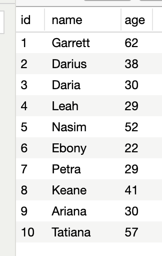

#### 1. What is the purpose of a primary key?
- [ ] it is a value used to reference a row in another table
- [x] it is a value that uniquely identifies a row in a table
- [ ] it is the way that an RDBMS identifies a table in a database
- [ ] it is a value computed from the values of other columns in a table 

---

#### 2. Assuming no related data exists, what would the SQL statement `DELETE FROM users;` do?
- [ ] delete all logins from the database
- [x] delete all of the data from the table "users"
- [ ] delete the most recently-added record from the table "users"
- [ ] nothing, because it is not valid SQL

---

#### 3. Which of the following statemnet can begin a valid PostgreSQL statement?
- [x] `DROP DATABASE`
- [x] `DROP USER`
- [ ] `INSERT USER`
- [x] `CREATE USER`
- [ ] `DELETE USER`
- [x] `CREATE DATABASE`
- [ ] `INSERT DATABASE`
- [ ] `DELETE DATABASE`

---

#### 4. What is a Relational Database Management System (RDBMS)?
- [x] a software package that manages relational databases and the users that can access it
- [ ] a container of data and the relations between the data
- [ ] the superuser that has all privileges to manage data in tables
- [ ] tables, primary keys, and foreign keys

---

  ```SQL
SELECT id, name, age
FROM people
WHERE id > 5
AND name LIKE '%e%';
```



#### 5. Given the above data and SQL statement, how many records will the SQL statement return? 
- [ ] 3
- [x] 2
- [ ] 1
- [ ] 5
- [ ] 4

---

#### 6. Which of the following statements would create a foreign key constraint between a column named "house_id" in the current table and the column "id" in the table "houses"?
- [ ] `FOREIGN KEY CURRENT_TABLE(house_id) REFERENCES houses (id)`
- [ ] `FOREIGN KEY house_id REFERENCES houses (id)`
- [ ] `FOREIGN KEY (house_id) REFERENCES houses.id`
- [x] `FOREIGN KEY (house_id) REFERENCES houses (id)` 
