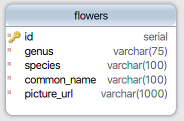

# API Design

#### 1. Given this data model, what RESTful endpoints would you handle in your Web app to support just creating a resource, getting all of the resources, and deleting a resource? (Remember that a RESTful endpoint is both an HTTP verb _and_ a URL/path.)
> Creating a resource: POST /flowers
> Getting all of the resources: GET /flowers
> Deleting a resource: DELETE /flowers/:id